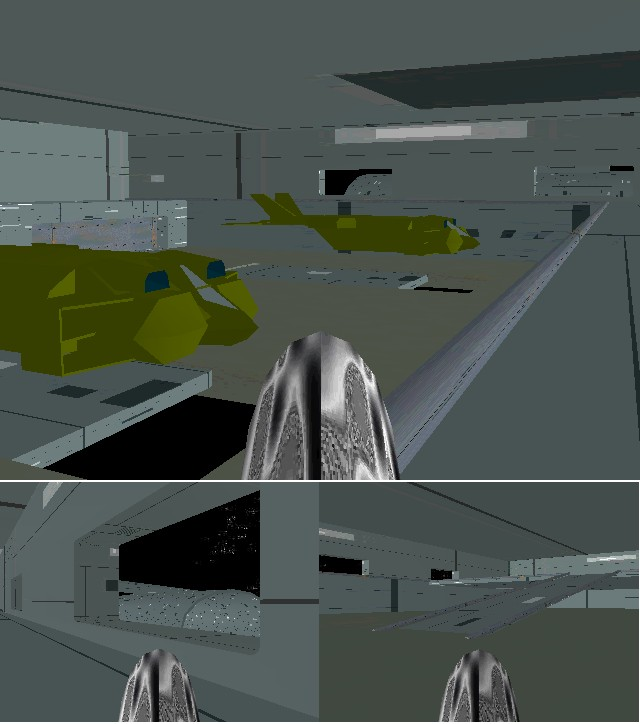



## DirectX7 \- Dropship Carrier \(YES collision detection IS possible \!\!\!\!\)

### Description

I've been labouring to achieve collision detection in directX and I'm pretty sure this is the best method so far, try it out! The answer was to draw a plan (or footprint) of the directX world in greyscale on a bitmap & use the picpoint method to create collision detection, sounds dodgy? check the code out.. It's fast (about 30fps for this example) & at least does away with inefficient tables & indicies.

Now you can stop yourself walking through walls, clib stairs & open doors (try the blue door).

Any comments would be greatly received.

BTW this is a pretty pleasant looking (if a bit grey - to save .zip space) little directX world to show a few examples of the method. Quick note, press 'I' to see information, 'ESC' to quit the program.

VERY IMPORTANT!!!!!!!!!

The texture files wouldn't upload to PSC so I've published them on the following web addresses, I know its a pain, but I just couldn't upload (made the zip file too big)

Go to the address, download the image to the 'textures' folder and rename them as below

http://photos.bravenet.com/921/451/014/143B7131BF.jpg

PLAN000001.jpg

http://photos.bravenet.com/921/451/014/69083C6148.jpg

PLAN000002.jpg

http://photos.bravenet.com/921/451/014/121339B6A5.jpg

starfield1.jpg

http://photos.bravenet.com/921/451/014/CEF4E68296.jpg

TEXTGUNB01.jpg

http://photos.bravenet.com/921/451/014/7AEBE60E7B.jpg

TEXTRUST11.jpg

http://photos.bravenet.com/921/451/014/E94BC0BD56.jpg

TEXTRUST01.jpg

http://photos.bravenet.com/921/451/014/E0703FA361.jpg

TEXTRUST02.jpg

http://photos.bravenet.com/921/451/014/00A4C47A44.jpg

TEXTRUST03.jpg

----

I'm really sorry about that, but I tried over 50 times to upload them and it just wouldn't work, maybe I can update the zip file when the sites in a more robust state.
 
### More Info
 

             |
---                |---
**Submitted On**   |2004-01-14 11:24:50
**By**             |[Phil Grossman](https://github.com/Planet-Source-Code/PSCIndex/blob/master/ByAuthor/phil-grossman.md)
**Level**          |Advanced
**User Rating**    |5.0 (15 globes from 3 users)
**Compatibility**  |VB 5\.0, VB 6\.0
**Category**       |[DirectX](https://github.com/Planet-Source-Code/PSCIndex/blob/master/ByCategory/directx__1-44.md)
**World**          |[Visual Basic](https://github.com/Planet-Source-Code/PSCIndex/blob/master/ByWorld/visual-basic.md)
**Archive File**   |[DirectX7\_\-1694541152004\.zip](https://github.com/Planet-Source-Code/phil-grossman-directx7-dropship-carrier-yes-collision-detection-is-possible__1-51016/archive/master.zip)

